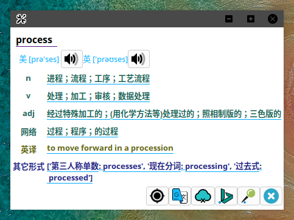
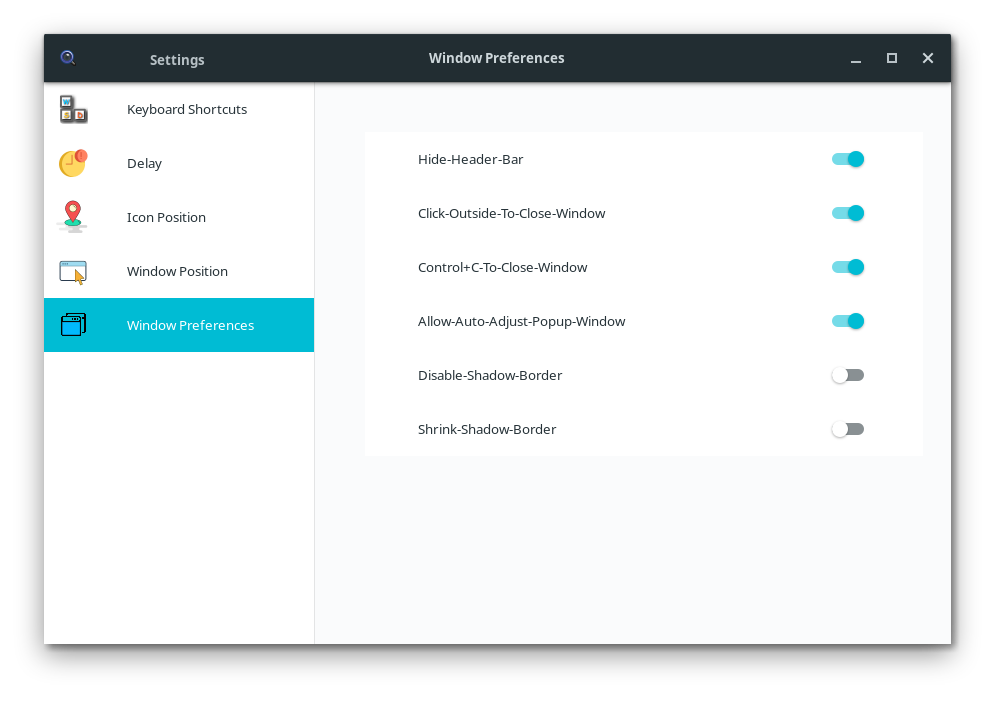

## 离线功能若要正常使用，请将Python更新到3.8及以上

<br> 

### 注意安装后将 `/etc/gdm/custom.conf` 里的 `#WaylandEnable=false` 前面的 `#`号注释掉，使用Xorg服务，否则xdotool无法工作

### 2020-04-14 更新说明
* #### 重构鼠标动作识别相关代码
* #### 指针位置获取移至 shortcutListener.c
* #### 增加可选功能: 忽略选中的中文文本 ( 启用后选中中文不弹出图标 )

### 2020-04-03 更新说明
* #### 增加功能: 
   * 1. 禁用项目的边框阴影功能(Disable-Shadow-Border)
   * 2. 削减边框阴影宽度(Shrink-Shadow-Border), 此优先级比1高. 

* #### 增加功能的作用
   * 上述功能1将原来边框的阴影设置为窗口背景色
   * 上述功能2将边框宽度设置为1达到消除边框的目的，可用以禁用窗口特效中的Deepin以防止窗口四周出现黑框.

### 2020-04-01 更新说明
* #### 禁用了GTK默认decoration，改由我们的项目完成，以更好的支持对窗口的相关操作.
* #### 修改窗口位置调整逻辑

### 2020-3-29更新说明：
* #### 重新设计了翻译窗口界面，重构并简洁了这部分的代码，窗口不再出现空间无法容纳文本的情况.
* #### 新增依赖 libbsd, 安装详情见后面的编译安装部分

### 2020-3-11 更新说明：添加任务栏图标，右键图标后选择`Settings`可进入设置窗口，或者通过快捷键Shift+Control+M.
#### 设置包含：
* #### 相关快捷键自定义设置
* #### 弹出图标消失时间设置
* #### 弹出图标位置设置 （拖动location图标，点击save change按钮保存并应用设置，否则抛弃当前更改）
* #### 弹出窗口位置设置 （拖动鼠标图标, 点击save change按钮保存并应用设置，否则抛弃当前更改）
* #### 其他相关偏好设置


### 2020-3-11 新更新变动：
* #### 捕捉快捷键由原来的监听设备文件改为使用Xlib完成

### 目前已知问题:
* #### 有一定几率程序崩溃, 具体原因未知，只知道是由Xlib引起，详见src/bugRecord.log, 崩溃后管控程序会自动重新运行.
* #### 有时候双击不弹出图标，待解决
* #### 剪贴板变化通知功能异常(checkSelectionChanged.c)，导致图标一直无法弹出 ( 重启直到该功能正常工作可解决 )


# 一. 程序功能
## (一). 目前功能
### 1. 屏幕取词翻译 -- 中英互译 （全局）
### 2. 快速搜索功能 -- 快捷键调出搜索框，输入后回车获取翻译（全局）
### 3. 添加了离线支持 -- 仅支持单词（总词数约38万）
### 4. 截图翻译    --  默认截图快捷键 Alt+d  <br><br>
  * 目前基本不支持中文，识别准确率孱弱，有时间再改进。
  
  

  #### Ubuntu 19.04 测试通过:

   

  #### Arch Linux 测试通过:

    

 #### Deepin Linux 测试通过:
 


### 相关功能及设置说明: 
* #### 翻译窗口底部按钮从左到右分别为:
  * 设置 -> 校准 -> 谷歌翻译 -> 离线翻译 -> 必应翻译 -> Pin -> 退出 ( 其中校准按钮只做调试使用 )
   

* #### 相关设置说明
  * 快捷键除了播放音频和切换翻译源显示外，其他都不允许只有一个键作为快捷键，必须带上Modifier，比如Control，Shift等，~~另外如果Gnome使用了Super键作为Overview功能，带Super键的快捷键设置会无效。~~,更换了快捷键捕捉方式，问题已得到解决。
  
  * 选中文本后弹出的图标延迟时间可在`Delay`中设置，弹出图标后如果没有鼠标左键点击非图标区域外事件，图标将在此设置的时间之后消失，如果弹出图标后点击左键于空白区域，图标将即刻消失
  
  * `Icon Position`中拖动 `Location` 图标，改变其与指针的相对位置，此设置将对应应用到实际选中文本后弹出图标相对于鼠标指针的位置, 设置后记得点击 `Save Change` 保存设置，否则此次设置将会被丢弃。

  * `Window Preferences` 目前提供偏好设置有 
    * 隐藏标题栏
    * 区域外点击鼠标则关闭翻译窗口
    * Ctrl+C 关闭窗口
    * 允许自动调整翻译窗口位置（此选项主要针对翻译窗口在顶部或底部按照预定位置显示会遮挡选中文字时生效，比如图标位置设置为指针上方，窗口位置设置为指针上方，如果经过计算窗口位置将遮挡住选中文字，其将自动调整显示窗口到指针下方）
    * 底部包含一张翻译窗口的图片，以及可移动指针。移动指针到你想要的位置，此设置将实际应用到弹出的翻译窗口相对于指针的位置,设置后记得点击 `Save Change` 保存设置，否则此次设置将会被丢弃。

* #### 设置窗口如图所示：

  


# 二. 运行效果图示 
* [x] 截图翻译演示<br><br>
 <br><br>

* [x] 浏览器演示<br><br>
 

<br> 

* [x] 快速查找功能 \<Alt-J> 触发， Ctrl-C 或 ESC 关闭，翻译界面只支持ctrl-C关闭，窗口失焦状态ctrl-c同样适用，要关闭此功能需修改源码，后期发布详情 （修改源码可更改快捷键，详情见issue）<br><br>


<br>

# 三. 程序目前已知问题

- [ ] **程序只支持Xorg的桌面，并且系统必须禁用Wayland。** 

<br> 

# 四. 程序编译安装
1. 先将源码克隆到本地 

        $ git clone https://github.com/poemdistance/ScreenTranslation --recursive

    如果代码已经下载过一次并做了修改，需要同步到上游到最新状态覆盖本地的，参考：
    [Git 下游更改后强行恢复至上游最新状态, 更新submodules至最新状态](https://poemdear.com/2019/08/29/git-%e4%b8%8b%e6%b8%b8%e6%9b%b4%e6%94%b9%e5%90%8e%e5%bc%ba%e8%a1%8c%e6%81%a2%e5%a4%8d%e8%87%b3%e4%b8%8a%e6%b8%b8%e6%9c%80%e6%96%b0%e7%8a%b6%e6%80%81-%e6%9b%b4%e6%96%b0submodules%e8%87%b3%e6%9c%80/)
  

2. cd到src目录  

        $ cd ScreenTranslation/src
   
3. 安装依赖  Xlib X11 Xtst Xext gtk3开发环境(gtk.h, gtkwindow.h)
 
   * For system base on Debian  (Ubuntu, Kali etc.)

          sudo apt-get install build-essential gnome-devel libx11-dev libxtst-dev
          sudo apt-get install python3-pip liblzma-dev
          sudo apt-get install xdotool
          sudo apt install  tesseract-ocr libtesseract-dev meson
          sudo pip3 install pytesseract tesseract pillow meson
          sudo apt install libcanberra-gtk3-0  libcanberra-gtk3-dev  libcanberra-gtk3-module
          sudo apt install libbsd-dev  #03-29新增


   * For Arch Linux 

          sudo pacman -S gtk3  libxtst libx11  xdotool  python-pip  
          sudo pacman -S tesseract meson
          sudo pip3 install pytesseract tesseract pillow meson
          sudo pacman -S libbsd #03-29新增

          #图像识别相关依赖作者安装太久了，不知道有没有漏掉什么...

  
4. 终端执行命令完成项目安装
        
        make prepare && make && make install


<br><br>

# 五. 离线库下载与安装

* 百度云速度太慢，不考虑作为上传地址，github有上传大小限制，也放弃了，选择了一个国外的云盘Mega，速度很不错，限流不限速，需要使用离线功能的童鞋可能需要先注册一个Mega账号，下载好后再往下操作。
 
  * 下载链接:https://mega.nz/#F!BuJQmSZA!aRwJ65QBHwnq55qy2S4_Bw
 
 <br>

1. 解压下载文件 <br> 

* 将`WordMp3`放置于家目录，`dict.sql`请随意. <br>
  解压命令:

         tar xfv offlineTranslationResources.tar.gz 


2. 安装数据库 
 
 * For Arch <br>
                
         sudo pacman -s mariadb
   
  * For Debian serias
        
         sudo apt install  mariadb-server 
   
3. 创建数据库并导入dict.sql (请在普通用户模式下执行) 


* 
        #启动数据库
        sudo mysql -u root -p  #在普通用户模式下执行，然后一路回车设置空密码

<br> 

 *      # 出现如 MariaDB [(none)]> 画面时依次输入下面的命令(注意替换YOUR_SYSTEM_USER为自己的用户名： 
  
        CREATE USER 'YOUR_SYSTEM_USER'@'localhost' IDENTIFIED BY '';
        GRANT ALL PRIVILEGES ON *.* TO 'YOUR_SYSTEM_USER'@'localhost';
        FLUSH PRIVILEGES;
        create database dict;
        exit;

        #注意如此操作后以后都必须用用户名连接数据库，想要使用其他方法适应项目的可以自己探索。

<br> 

* 
        #终端操作命令导入数据库
        mysql -h127.0.0.1 -u$USER -p dict < dict.sql #终端命令导入数据库

* 
         #设置Mariadb自启动

         systemctl enable mariadb
         systemctl start mariadb

<br>


# 六. 使用过程中的问题
 
1. 运行后长时间未使用软件，在第一次双击后可能会不弹出图标，或者翻译结果呈现上一次未知的复制，是因为复制操作有延时，程序获取成了上一次的复制结果
 
2. 程序有较小几率呈现出上一次的翻译结果，原因是上一次结果获取较慢，直到在这一次中才呈现出来，打乱了步伐

3. 程序有较小几率显示不完美，也跟翻译速度影响有关

4. 百度或者谷歌翻译如果在翻译过程中出了问题，可能是网络原因，也可能是代码本身的Bug，由于翻译结果的不确定性，不保证已经将全部因素考虑进去，有可能翻译某些特定情况的时候使程序奔溃，重启便可。如果多次选中同一个文本都产生崩溃，那便是代码的问题。如果重启后一切恢复，便是网络问题，即有可能是网络不好，或者百度的反爬虫机制导致的。

5. 如果想协助作者完善此软件，请在程序崩溃后将日志文件 `/var/log/mstran.log`发送至作者github同名gmail邮箱:`poemdistance@gmail.com` 
 
6. 软件是有桌面图标的，安装成功并重启后按Super键，搜索Mstran即可找到，点击图标会打开或者重启翻译软件。


# 七. 更新上游项目并安装

## 1. 项目更新 

步骤一.

          #注意这条命令自始至终只需要在项目中执行一次

          git remote add upstream https://github.com/poemdistance/ScreenTranslation  

步骤二.
          
          #注意以下命令会覆盖掉本地已有的修改

          git fetch upstream
          git checkout master
          git reset --hard upstream/master

步骤三.

          git submodule foreach git pull origin master 

## 2. 项目安装

步骤四. <编译/安装项目> 

        参照上面的安装步骤 2  4  5  （更新不需要重启)


<br> 

# 八. 程序运行与停止

  * **NOTE**: **电脑如果安装了wayland，需要禁用**，不然终端中无法正常使用xdotool,方法如下：<br>
     *  打开/etc/gdm/custom.conf
        添加如下两行(完成后需要重启)
        ```
        [daemon]
        WaylandEnable=false
        ``` 
  * **相关依赖**： 
      1. C语言库: Xlib X11 Xtst Xext gtk3开发环境
      2. 终端命令行工具: xdotool, ps, awk, tail 

        
   * **在某些应用中禁用取词翻译** <br>

       找到`fordetectMouse.c`中的如下内容:

         const static char wantToIgnore[][20] = {
           "VirtualBox",
           "VirtualBoxVM",
           "vlc",
           "qemu-system-arm",
           "nautilus",
           "eog",
           "gimp-2.10"
         };

      **将需要忽略的应用名称添加进数组保存，重新编译项目并安装。**

1. 直接运行编译后生成的可执行文件mstran (**软件有应用图标，名为Mstran，点击图标亦可运行**)
 
        $  mstran 
    
      这种情况会有很多输出信息，一般是拿来作为调试信息的<br><br>

        $  mstran > /dev/null &
  
     放置在后台执行，重定向输出到/dev/null <br> <br>

     停止运行:   

        $ bash ~/.stran/stop.sh (或终端直接执行stoptran)


<br> 


# 九. 程序运行异常问题

   
1. 如果**运行报错failed to open mice的问题**，这个是因为没有权限打开文件进行读写导致的，可以有如下解决办法：    
    * **方法一: 添加当前用户到/dev/input/mice的用户组中**：<br>
        * a. 先查明此文件设备所在用户组,使用命令:<br> 
  
                $ ls -l /dev/input/mice

           b. 得到结果类似如下:<br>  

                crw-rw---- 1 root input 13, 63 Jul 27 09:09 /dev/input/mice

           c. 其中的input即是其所在用户组，得到后使用如下命令**添加用户到input用户组并重启系统**:<br> 

                $ sudo usermod -aG input $USER
            
            **Note**: **如果设备文件没有用户组，请先手动设置规则添加，网上很多相关内容，这里不赘述.** <br><br>

    * **方法二: 使用sudo执行此程序**: <br> 
     
           sudo mstran 

         中途测试过程中以root用户或者说sudo执行时Xdisplay发生过 No protocol specified的错误，所以此方法不一定奏效，但也可能是当时系统忘记关闭Wayland导致的。

<br>

# 十. 支持作者

  * 看都看到这里了，打赏一个呗 :P
  
     

 &nbsp;&nbsp;&nbsp;&nbsp;&nbsp;&nbsp;&nbsp;&nbsp; &nbsp;&nbsp;&nbsp;&nbsp;&nbsp;&nbsp;&nbsp;&nbsp;&nbsp;&nbsp;&nbsp;&nbsp;&nbsp;&nbsp;&nbsp;&nbsp;&nbsp;&nbsp;支付宝 &nbsp;&nbsp;&nbsp;&nbsp;&nbsp;&nbsp;&nbsp;&nbsp;&nbsp;&nbsp;&nbsp;&nbsp;&nbsp;&nbsp;&nbsp;&nbsp;&nbsp;&nbsp;&nbsp;&nbsp;&nbsp;&nbsp;&nbsp;&nbsp;&nbsp;&nbsp;&nbsp;&nbsp;&nbsp;&nbsp;&nbsp;&nbsp;&nbsp;&nbsp;&nbsp;&nbsp;&nbsp;&nbsp;&nbsp;&nbsp;&nbsp;&nbsp;&nbsp;&nbsp;&nbsp;&nbsp;&nbsp;&nbsp;&nbsp;&nbsp;&nbsp;&nbsp;&nbsp;&nbsp;&nbsp;&nbsp;&nbsp;&nbsp;&nbsp; 微信

# 十一. 程序内部逻辑流程图

