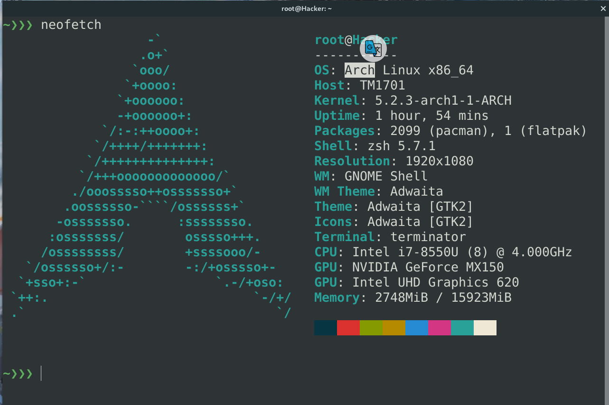
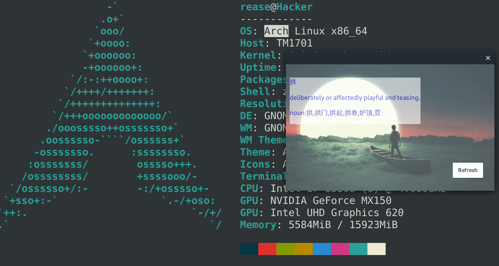
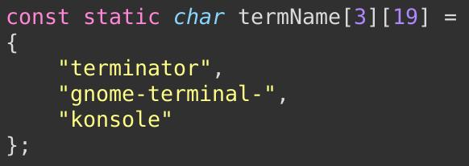
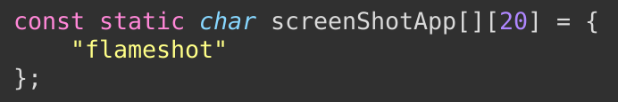
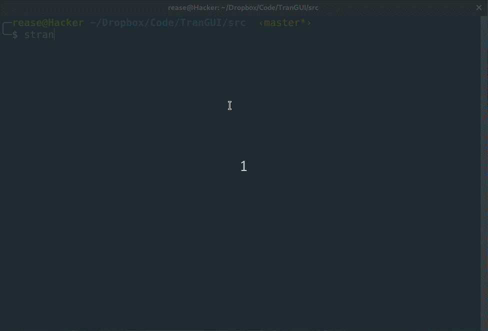

# 一. 程序功能
## (一). 目前功能
1. 屏幕取词翻译 -- 中英互译
   
   <br><br>
    

### refresh 键功能说明: 
* 因为优化了三击取词的准确性后，降低了双击取词的速度，影响了体验，故增加一个刷新键，从双击到三击的过渡，如果先选中了单个词，则界面先对单词进行翻译呈现，按刷新键后才弹出3击所选中的句子或段落。 
 
* 当然，还是有可能直接就三击选中了段落或句子的。


## (二). 后期预计完成功能
1. 单词收藏
2. 离线翻译
 
 <br> 

# 二. 程序编译安装
1. 先将源码克隆到本地<br><br>
2. cd到src目录<br><br>
3. 安装依赖  Xlib X11 Xtst Xext gtk3开发环境(gtk.h, gtkwindow.h)
 
             # For system base on Debian 
          $  sudo apt-get install build-essential gnome-devel libx11-dev libxtst-dev

             # For Arch Linux
          $  sudo pacman -S gtk3  libxtst libx11      


5. 终端执行命令 
   
          sudo sh prepare.sh && make && make install
           
<br> 

# 三. 程序运行与停止
1. 运行**先决条件** <br>
     * **安装这个项目 https://github.com/poemdistance/google-translate 上的在线翻译程序**，其安装使用等相关事项见项目根目录的README. 确保此翻译程序能正常运行。另外，一般情况下，谷歌翻译爬虫项目会跟屏幕取词翻译同步更新，想要更新任何一个的话，两边都git pull一下。<br><br>
     * **NOTE**: **电脑如果安装了wayland，需要禁用**，不然终端中无法正常使用xdotool,方法如下：<br>
        *  打开/etc/gdm/custom.conf
           添加如下两行(完成后需要重启)
           ```
           [daemon]
           WaylandEnable=false
           ``` 
     * **相关依赖**： 
         1. C语言库: Xlib X11 Xtst Xext gtk3开发环境 (不知道有没有漏掉什么...,等我到其他机器测试完发现有遗漏再来补充)
         2. 终端命令行工具: xdotool, ps, awk, tail 
   
     * **使程序在终端正常运行请完成如下步骤:**<br>
       * 终端执行 ps -p \`xdotool getwindowfocus getwindowpid\` |awk '{print $NF}' | tail -n 1 

          将得到的终端应用名添加到**forDetectMouse.c**的**termName数组**中并拓展数组容量，否则在监测终端复制文字的时候发送的是Ctrl-C，而不是真正的复制快捷键Ctrl-Shift-C。 ( terminator, gnome-terminal以及konsol已经默认添加进了数组). <br><br>
           
     
     * **与截图软件共存的问题**<br>
         * 截图软件在进行区域选择的时候，同样会被程序捕捉到，这个时候如果发送Ctrl-C可能导致截图软件异常退出，程序在进行剪贴板内容获取的时候也会发生段错误，此时打印信息中已经包含了截图软件名称，可以将此名称添加到forDetectMouse的screenShotApp数组中，将程序重新编译安装运行即可(即二中的步骤4，但是可以不再运行`prepare.sh`)

          数组如下(已经默认添加flameshot截图软件):<br><br> 
          
           

2. **如果终端使用了Smart copy，在没有选中任何文字的时候，可能会使模拟发送的Ctrl-Shift-C被终端视为Ctrl-C而导致运行中的程序意外结束，这不是本程序的Bug，可以将Smart Copy关闭防止此类危险情况发生**

3. 直接运行编译后生成的可执行文件stran 
 
        $  stran 
    
      这种情况会有很多输出信息，一般是拿来作为调试信息的<br><br>

        $  stran > /dev/null &
  
     放置在后台执行，重定向输出到/dev/null <br> <br>

     停止运行:   

        $ kill `ps -aux | grep stran | head -n 1 |awk '{print $2}'|xargs` 


<br> 

# 四. 运行效果图示 
* [x] 终端演示，用双击以及区域选择进行取词翻译<br><br>
 <br><br>

* [x] 浏览器演示，用三击取段，单击取词以及区域选择取句翻译

 

<br>

# 五. 程序目前已知问题


- [ ] Python翻译程序如果异常退出，C语言程序会继续运行但不会得到任何翻译结果，可以重启程序回到正轨
- [ ] **程序只支持Xorg的桌面，并且系统必须禁用Wayland。** 

<br> 

# 六. 程序运行异常问题

1. 如果程序提取到用鼠标获取的结果一直是同一个或者为空，但是用键盘Ctrl-c操作能够获取到对应新的文本,换而言之就是鼠标取词不起作用，这说明打开的键盘设备文件是错的，模拟发送的Ctrl-c不会被捕捉到，此时可以用如下命令得到真正的键盘设备: <br> 
    
         cat  /var/log/Xorg.xx.log | grep keyboard | grep event | tail -n 1  

    (请将Xorg.xx.log替代为你当前系统的实际日志文件)，其输出类似:<br> 

        [275.556] (II) event3  - AT Translated Set 2 keyboard: device removed 

    可以看到，当前我系统使用的键盘设备文件是`/dev/input/event3`<br> 
    当然，我们也可以用其他方法来查明。

    **最后找到DetectMouse.c中/dev/input/eventX这条语句，将eventX修改成你实际得到的结果重新编译运行即可**
  
   
2. 如果**运行报错failed to open mice的问题**，这个是因为没有权限打开文件进行读写导致的，可以有如下解决办法：    
    * **方法一: 添加当前用户到/dev/input/mice的用户组中**：<br>
        * a. 先查明此文件设备所在用户组,使用命令:<br> 
  
                ls -l /dev/input/mic

           b. 得到结果类似如下:<br>  

                crw-rw---- 1 root input 13, 63 Jul 27 09:09 /dev/input/mice

           c. 其中的input即是其所在用户组，得到后使用如下命令**添加用户到input用户组并重启系统**:<br> 

                sudo usermod -aG input userName
            
            **Note**: **如果设备文件没有用户组，请先手动设置规则添加，网上很多相关内容，这里不赘述.** <br><br>

    * **方法二: 使用sudo执行此程序**: <br> 
     
           sudo ./main 

         中途测试过程中以root用户或者说sudo执行时Xdisplay发生过 No protocol specified的错误，所以此方法不一定奏效，但也可能是当时系统忘记关闭Wayland导致的。

<br>
